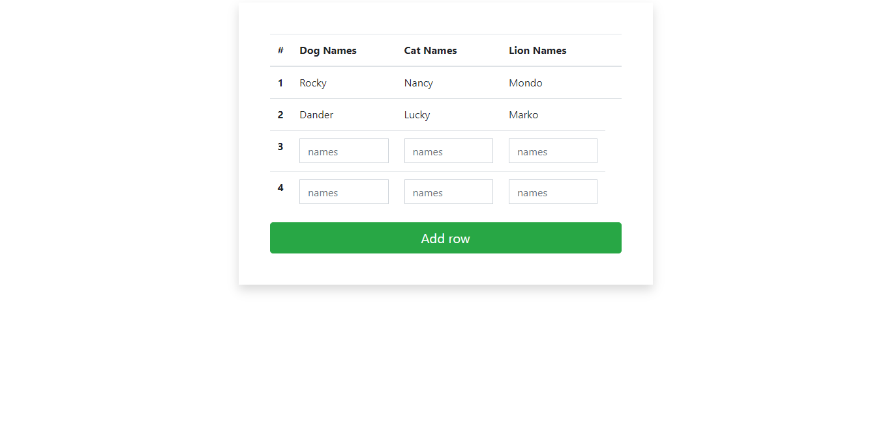

# Week-10-coding

<h2> Bootstrap Styled Data Table Form</h2>

 It was made using Javascript , Bootstrap and Jquery

 It allows users to inout Data into the form as a new row 
once they click the submit button .  The table adds a new row every time the user inputs 
data.

 

